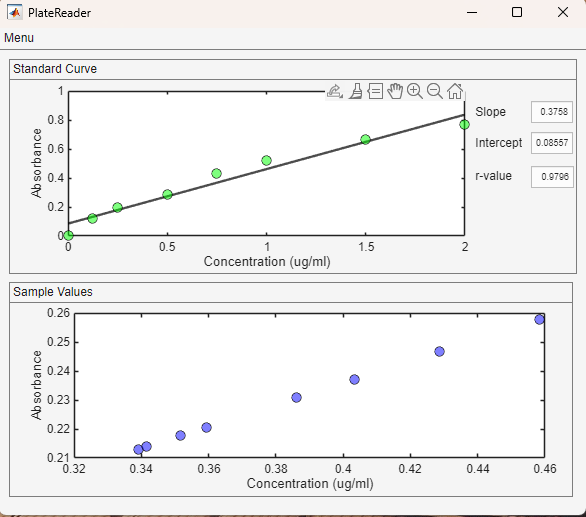

## PlateReader

PlateReader is simple open-source software to calculate concentrations via plate reader assays developed by [Utku Gulbulak](mailto:utku.gulbulak@uky.edu) and [Ken Campbell](mailto:k.s.campbell@uky.edu)

