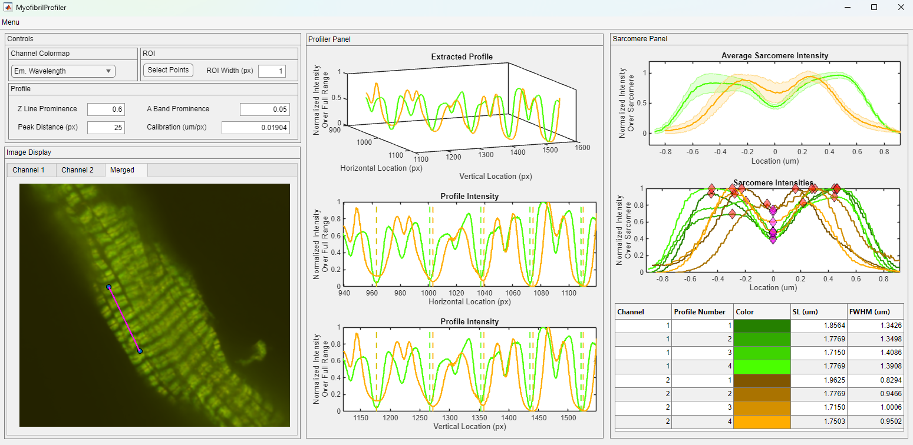

## MyofibrilProfiler

MyofibrilProfiler is an open-source software developed to extract and analyze striated patterns from muscle preparations labeled with immunofluorescent agents. It seamlessly works with proprietary microscope image file formats (ND2) as well as standard image formats (TIF and PNG). The software is developed by [Utku Gulbulak](mailto:utku.gulbulak@uky.edu), [Thomas Kampourakis](mailto:tka265@uky.edu), and [Ken Campbell](mailto:kscamp3@uky.edu).

