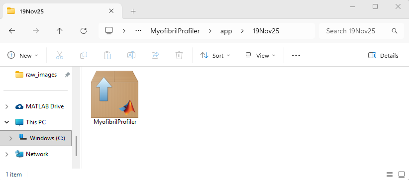
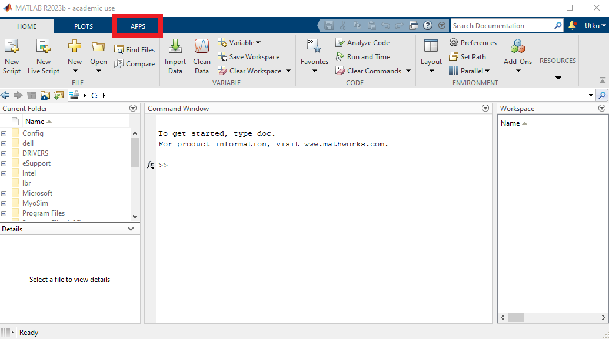
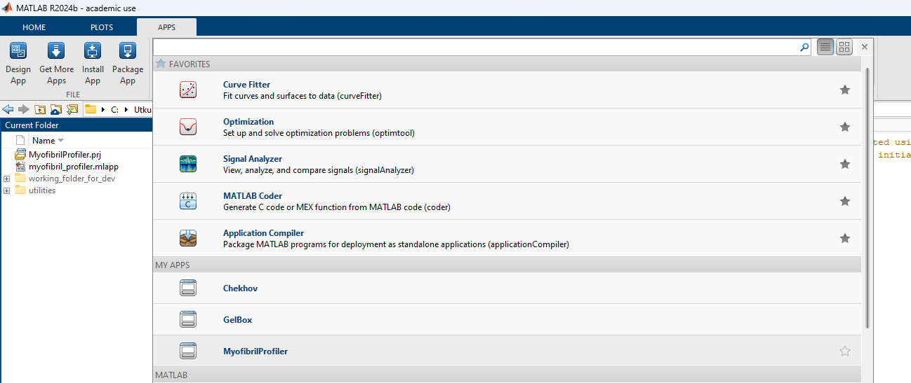

# Installation

## Instructions for MATLAB App Installation

This page instructs you on how to install MyofibrilProfiler as a MATLAB App.

+ The MATLAB App installer file can be downloaded from the [GitHub page](https://github.com/Campbell-Muscle-Lab/MyofibrilProfiler/tree/main/app/24Mar26). 24Mar26 installer is the current MyofibrilProfiler build. In this case, the installer file is located under your designated Downloads folder.
+ Users can also clone the MyofibrilProfiler repository and access the MATLAB App installer file. The installer file is located under `<repo>app\24Mar26`.  The instructions on how to clone a repository can be found [here](../cloning_myofibrilprofiler/cloning_myofibril_profiler.html).

Locate `MyofibrilProfiler.mlappinstall` file on your computer.

Double-click the `MyofibrilProfiler.mlappinstall` and the file will include MyofibrilProfiler in your MATLAB Applications. Click Install when the below prompt appears.

After a couple of seconds, go to the Apps tab on the top menu of your MATLAB, shown in red rectangle.

You can find the MyofibrilProfiler application under the My Apps section, shown in red rectangle.

Now MyofibrilProfiler is ready to be used.
