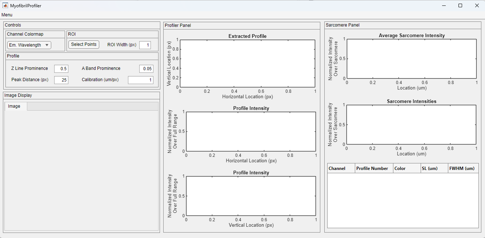
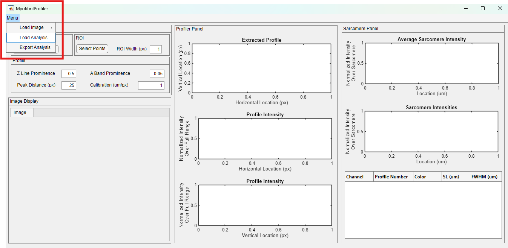
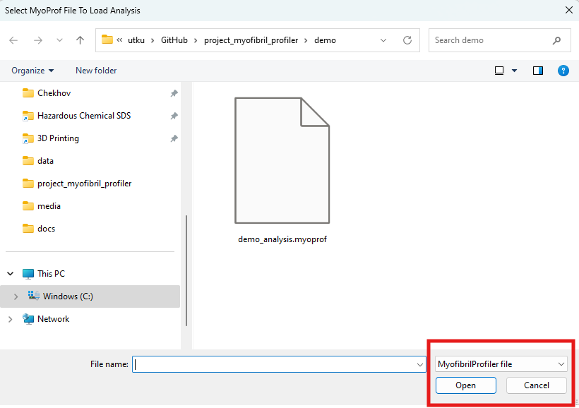
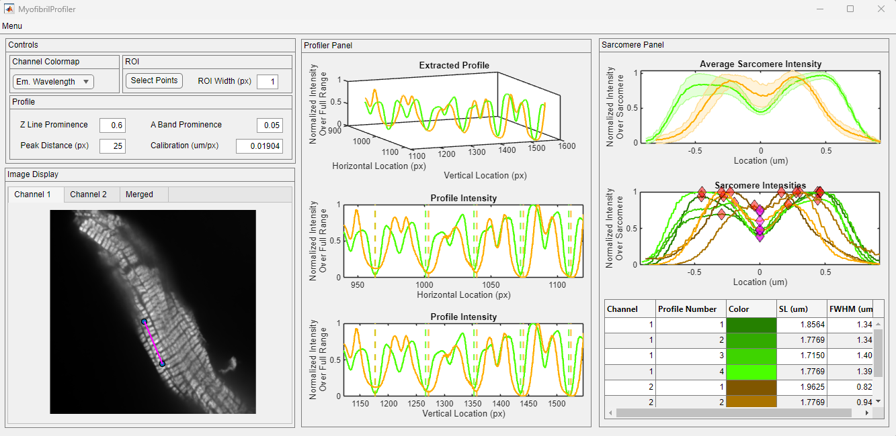

# **Load analysis**

This tutorial provides simple instructions on how to load an existing analysis with MyofibrilProfiler. Clicking on any of the images on this page will open a larger version in a new browser window. The preparation shown here was probed for myosin heavy chain and myosin light chain kinase.

## Getting started

+ Using the MyofibrilProfiler through MATLAB:
    - Launch MATLAB and navigate to the Apps tab on the top menu. Find the MyofibrilProfiler under My Apps and start the application by clicking it. The instructions on how to locate the Apps tab can be found [here](../../installation/installing_matlab_app/installing_matlab_app.html).

+ Using the MyofibrilProfiler as a stand-alone application:
    - Locate your `MyofibrilProfiler.exe` shortcut and start the application by double-clicking it.

After a few seconds, you should see the program window, given below. 

## Load analysis

The Load Analysis option can be found under the top menu, highlighted in the red rectangle below.

Once clicked, a file dialog window appears. Navigate to the folder with your analysis and click open. If you want to revisit how to save the .myoprof files, you can refer to the [start new analysis](../start_new_analysis/start_new_analysis.html) tutorial.

After a few seconds, the analysis file is loaded to the software. All the functionality described in [start new analysis](../start_new_analysis/start_new_analysis.html) tutorial is available.

