# **Start new analysis**

This tutorial provides simple instructions on performing a new analysis with PlateReader. Clicking on any of the images on this page will open a larger version in a new browser window. 

## Getting started

+ Using the PlateReader through MATLAB:
    - Launch MATLAB and navigate to the Apps tab on the top menu. Find the PlateReader under My Apps and start the application by clicking it. The instructions on how to locate the Apps tab can be found [here](../../installation/installing_matlab_app/installing_matlab_app.html).

+ Using the PlateReader as a stand-alone application:
    - Locate your `PlateReader.exe` shortcut and start the application by double-clicking it.

After a few seconds, you should see the program window, given below. 

<a href="media/platereader_app.png" target="_blank">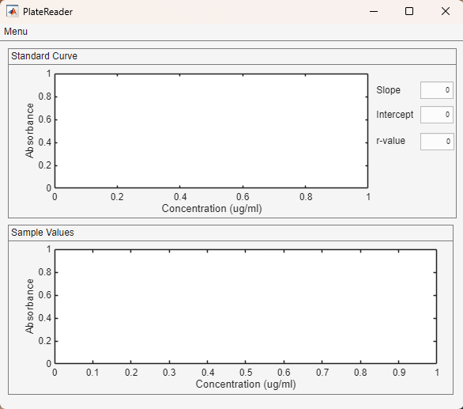</a>

## User panels

The interface is divided into multiple panels:

- Standard Curve: The measured absorbance values and known standard concentrations are shown here. The fitted line and its parameters are displayed as well.
- Sample Values: The measured absorbance and calculated concentration values are shown here.

## Loading layout

Users start their analysis by loading their layout to the software environment. These layout files should consist sample level information, plate level information, and standard concentrations.

The Load layout option is located under the Menu on the top left corner, shown in the black rectangle. Click on the Menu and access to the dropdown menu.

<a href="media/load_layout_menu.png" target="_blank">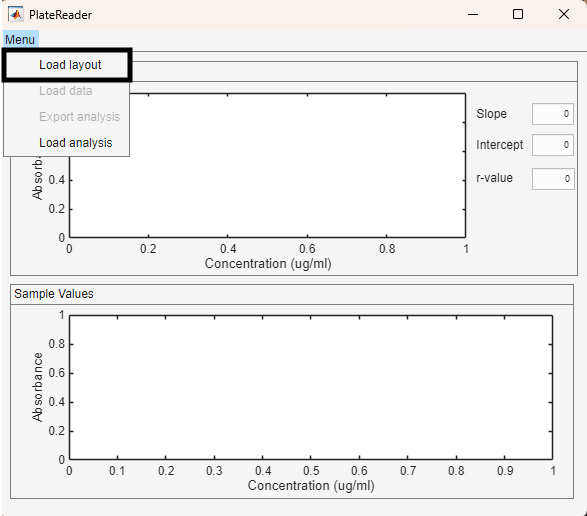</a>

Clicking opens the below file dialog. The dialog automatically looks for the .XLSX files. Navigate to your folder with the image files and click Open.

<a href="media/load_layout_dialog.png" target="_blank">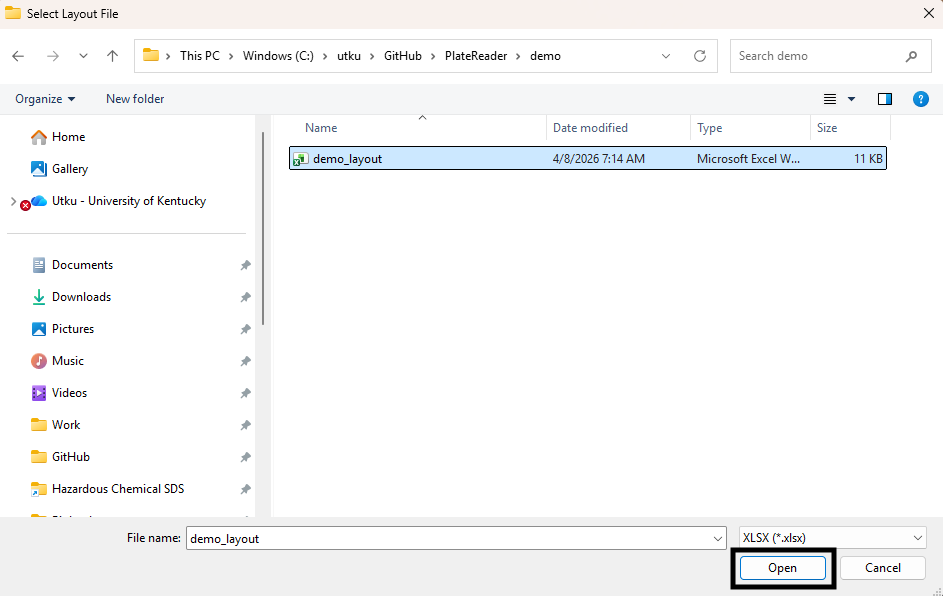</a>

### Layout: Sample layout

This spreadsheet consists of sample level information.

- hashcode: Deidentified ID
- specimen_no: Specimen number of the sample. In case of an isolated mitochondria experiment, please use numbering, i.e. 1,2,3 and so on.
- region: The region of which this sample is taken from.
- experiment_date: Date of the experiment.
- well_no: Loaded well ID, a letter followed by the column number.


<a href="media/layout_sample_layout.png" target="_blank">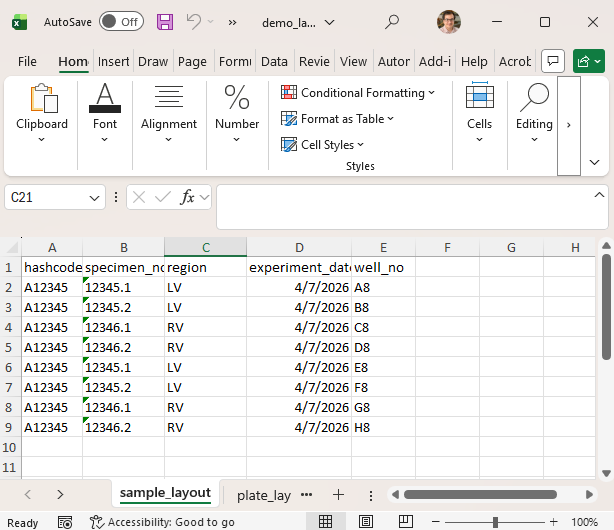</a>

### Layout: Plate layout

This spreadsheet consists of plate level information. It is a "look-up" table for software to identify the contents of the plate. The example is a 96-well plate but it can be modified as needed as long as the column names are named in the same way. Please make sure to use "Blank","Standard", and "Sample".

<a href="media/layout_plate_layout.png" target="_blank">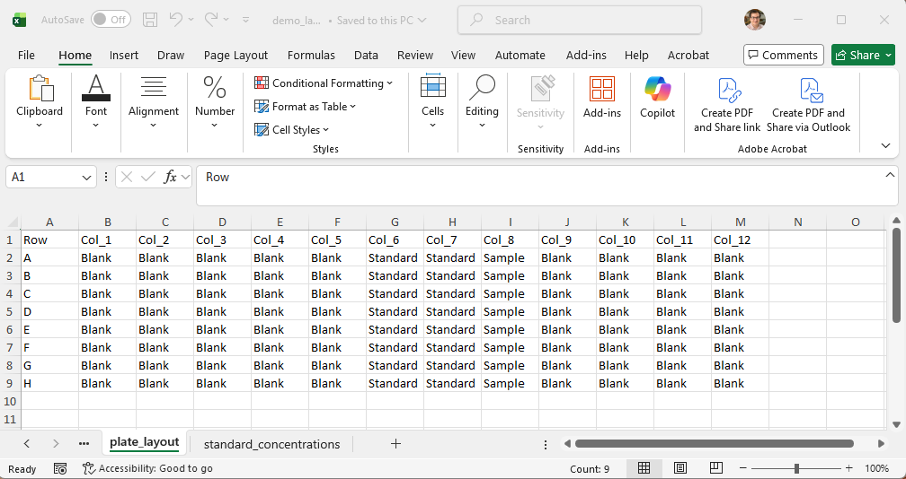</a>

### Layout: Standard concentrations

This spreadsheet consists of the known concentrations of the loaded standard column.

<a href="media/layout_standard_concentration.png" target="_blank">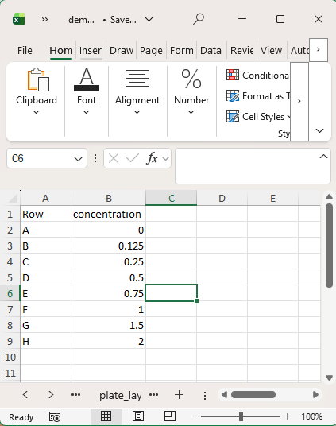</a>

## Loading data

The next step in the analysis is to load the raw data from the plate reader. This file is exported from the instrument in a text format. Please make sure to wells are not marked in the instrument, since the calculations will be done separately.

You can follow the below video to export raw data from the plate reader.

<video src="media/how_to_export_txt_file.mp4" controls="controls" style="max-width: 730px;"></video>

<a href="media/demo_data.png" target="_blank">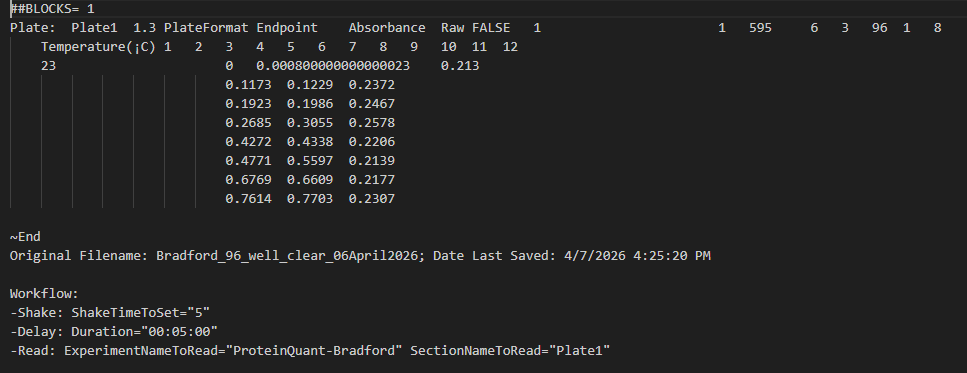</a>

The Load data option is located under the Menu on the top left corner, shown in the black rectangle. Click on the Menu and access to the dropdown menu.

<a href="media/load_data_menu.png" target="_blank">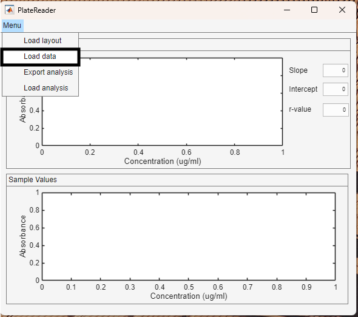</a>

Clicking opens the below file dialog. The dialog automatically looks for the .TXT files. Navigate to your folder with the image files and click Open.

<a href="media/load_data_dialog.png" target="_blank">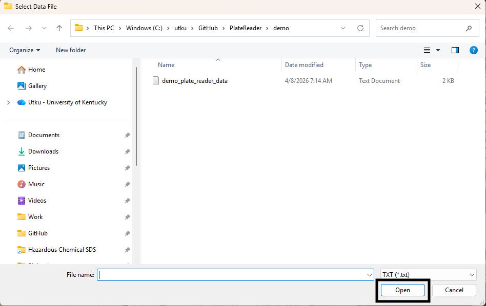</a>

## Analysis

Upon loading the data file, the analysis is automatically performed.

### Standard curve

The measured absorbance values are shown in green circles and the fitted line appears as a solid black line. This line is built as follows and all the values, including r value, are displayed on the right hand side.

```
absorbance = slope*concentration + intercept
```

### Sample values

The sample concentrations are calculated by solving the following equation for measured absorbance values.

```
concentration = (absorbance-intercept)/slope
```

### Export results

Once users are done with their analysis, they can export the analysis into their host computers. A summary Excel sheet and an analysis file with .pr extension are saved. The exported analysis files can be loaded back into the software to [revisit the analysis](../load_analysis/load_analysis.html).

Export analysis option is accessed through the top menu, shown in the black rectangle.

<a href="media/export_analysis_menu.png" target="_blank">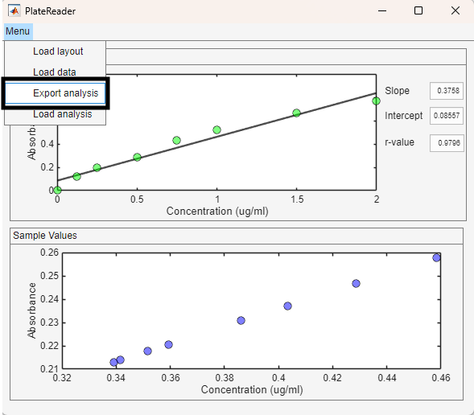</a>

Once it is clicked, it opens a file dialog. Navigate to the folder that you want to use.

<a href="media/export_analysis_dialog.png" target="_blank">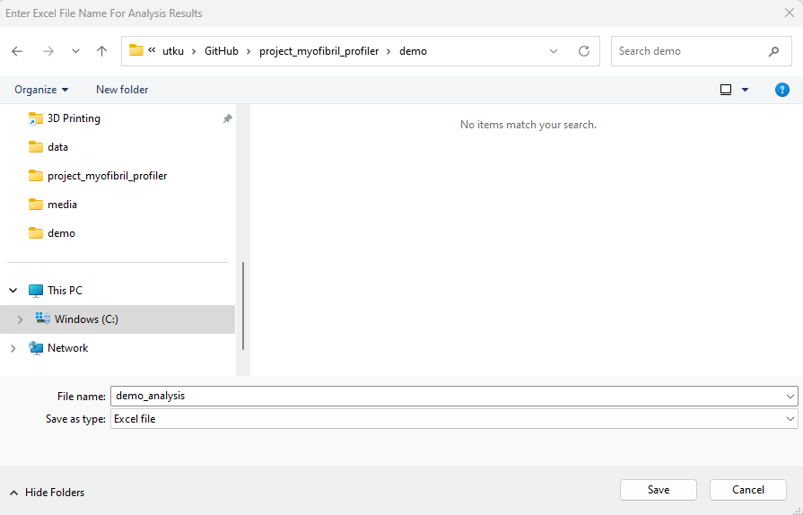</a>

The Excel file and the .pr file share the same name. Enter the name and hit Save. You can find both of the files under the designated folder.

<a href="media/exported_files.png" target="_blank">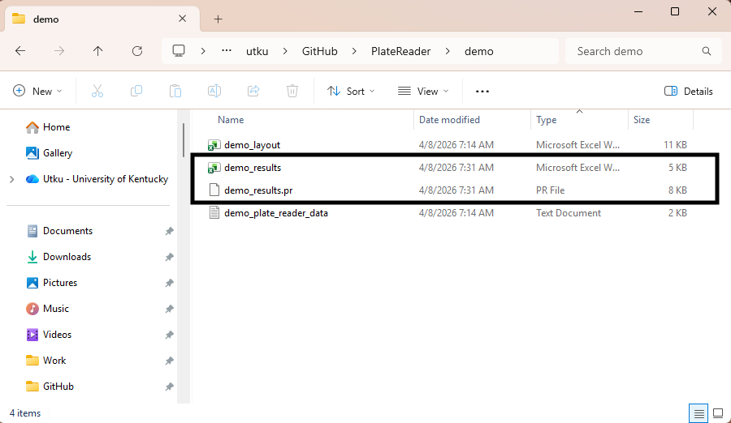</a>

The exported Excel file has multiple sheets. The first sheet is the analysis summary sheet. It combines the sample level information from the layout with the mean concentrations from wells.

<a href="media/demo_results_analysis_summary.png" target="_blank">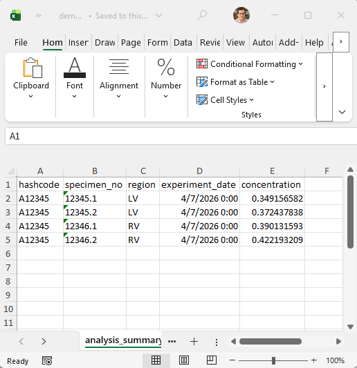</a>

The second sheet is the plate results. It is the sample layout merged with the concentration values from each well.

<a href="media/demo_results_plate_results.png" target="_blank">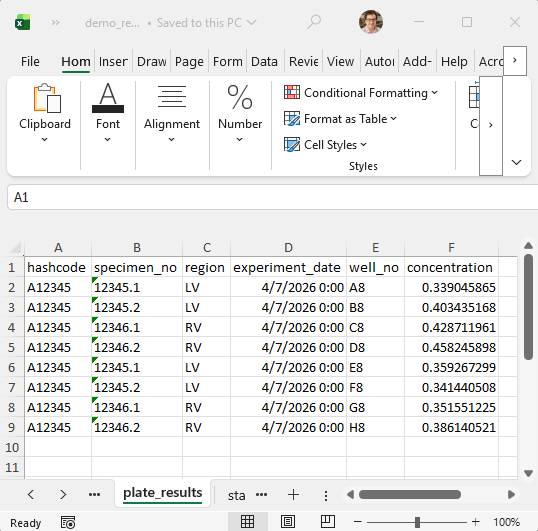</a>

The last sheet is the standard columns. It has the absorbance values of the loaded standard columns.

<a href="media/demo_results_standard_columns.png" target="_blank">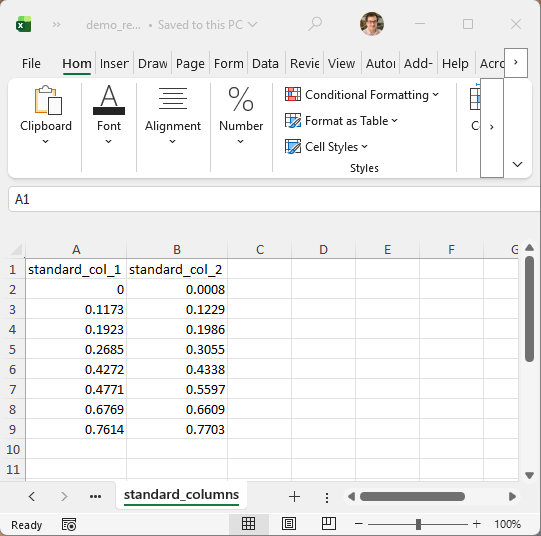</a>

